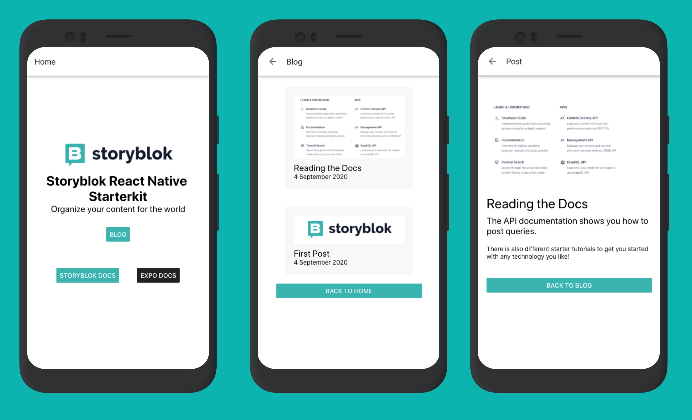
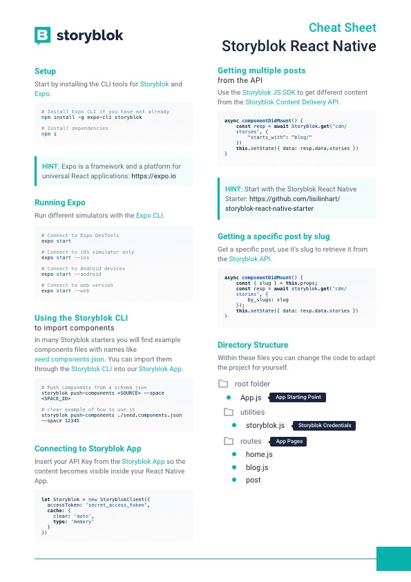

# Storyblok Starter Kit for React Native with Expo

<p>
  
</p>

## Table of Contents

- [About](#about)
- [Cheatsheet](#cheatsheet)
- [Getting Started](#getting_started)
- [Connecting Storyblok](#storybloksdk)
- [Importing the schema](#schema)
- [Running the PWA in Storyblok](#pwastoryblok)
- [Usage](#documentation)
- [Contributing](../CONTRIBUTING.md)

## About <a name = "about"></a>

Storyblok is a simple Headless CMS that can handle content across multiple platforms. This starter connects Expo with the Storyblok API to allow handling content across different platforms (web, android, ios).

<p>
  
</p>

## Cheatsheet <a name = "about"></a>

You can find all important steps on the cheatsheet or in the documentation below.

<a href="./assets/cheatsheet.pdf">
  
</a>


## Getting Started <a name = "getting_started"></a>

First you need to install the expo-cli

```bash
# Install Expo CLI if you have not already
npm install -g expo-cli

# Install dependencies
npm i
```

Then you can start the general or a specific simulator

```bash
# Connect to Expo DevTools & all simuluators
expo start

# Connect to iOS simulator
expo start --ios

# Connect to Android devices or simulators
expo start --android

# Connect to web version
expo start --web
```

## Connecting Storyblok <a name = "storybloksdk"></a>

In order to get your content you need to go to the [Storyblok App](http://app.storyblok.com/) and find your API Key.

Paste your API Key into `utilities/storyblok.js`:

```js
let Storyblok = new StoryblokClient({
  accessToken: 'my_very_secret_access_token',
  cache: {
    clear: 'auto',
    type: 'memory'
  }
})
```

## Importing the example content into Storyblok <a name = "schema"></a>

### Components
You can import the example components through the file `seed.components.json` with the [Storyblok CLI](https://github.com/storyblok/storyblok#push-components). For this you will need your space ID, which you can find in your space **settings**.

First you need to install the Storyblok CLI

```bash
# Install Storyblok CLI if you have not already
npm install -g storyblok
```

Then you can push the exisiting `seed.components.json` structure to Storyblok.

```bash
# how to use
storyblok push-components <SOURCE> --space <SPACE_ID>

# example
storyblok push-components ./seed.components.json --space 12345
```

After the import you will have all the components under `Components` in your left sidebar.

### Content
You can just run the `seed.js` file in this folder to add some basic content for the starter:

```bash
node seed.js --space=12345
```

Or you can create the content by hand in Storyblok:

1. Home: Add a title, description and logo
2. Blog: Create a new folder with the exisiting content type `Post`.
3. Post: Create a post with a title, image, intro, long text

## Running the PWA in Storyblok <a name = "pwastoryblok"></a>

If you run Expo in the web browser, you will be able to open a localhost connection like `http://localhost:19006/`. You can add this URL in the Storyblok settings under `Preview Urls` see the [Storyblok Documentation](https://www.storyblok.com/docs/guide/getting-started#setup-of-the-visual-editor-preview) for more details. Now you can preview your app directly in Storyblok and change the content.

## Documentation <a name = "documentation"></a>

This starter uses the following technologies:

- [Storyblok Documentation](https://www.storyblok.com/docs/guide/introduction)
  - [Storyblok Content Delivery API Documentation](https://www.storyblok.com/docs/api/content-delivery)
- [Expo Documentation](https://docs.expo.io/)
  - which is based on [React Native Documentation](https://reactnative.dev/docs/environment-setup)

## Deployment <a name = "deployment"></a>

### Apps
For detailed app deployment information look at the [Expo Deployment Documentation](https://docs.expo.io/distribution/app-stores/).

### PWA
Expo provides the following command to [build a PWA](https://docs.expo.io/guides/progressive-web-apps/).

```bash
## build a PWA
expo build:web

## disable asset & manifest generation
expo build:web --no-pwa
```